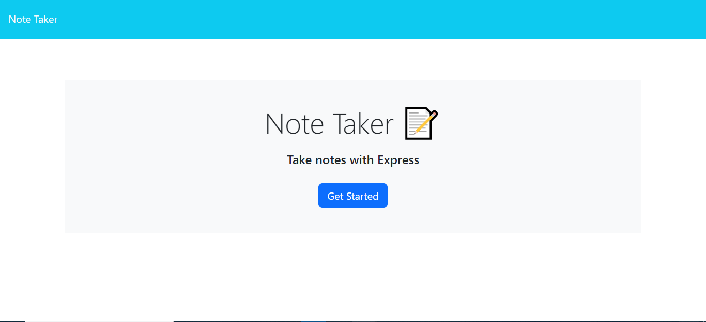
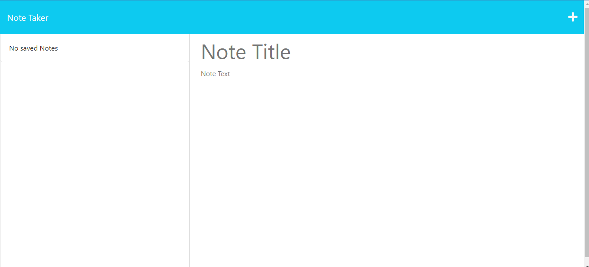

# Note Taker Starter Code

## Description

Welcome to the Expres Note Taker Repository! This repository contains an Express and Node.js application that retrieves data from the user in the form of notes and saves them in a json file. The application works whit the get, post and delete methods from Express. Algo it uses the npm modules of path and fs to read and write files within the archives. It allows user to storage important reminders for the close future. The application was deployed with heroku CLI and everyone can visit it, just follow the link!

## Usage 

To use the application,  all you have to do is follow the link down and star writing down things that are important!

https://protected-eyrie-93989.herokuapp.com

## Licence 

This repository is licenced under the MIT Licence.